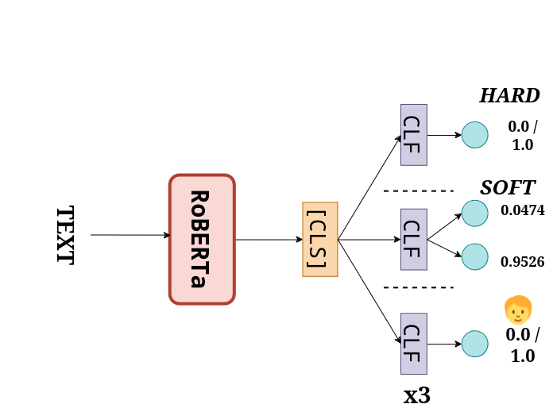

# DETESTS-DIS
The following repository contains the source code of my participation of the [DETEST-DIS](https://detests-dis.github.io/) shared task organized at IberLEF 2024. It is part of my final master thesis based on the detection and identification of racial and sexist stereotypes with a learning with disagreements (LeWiDi) approach. The thesis can be found on the following [link](https://riunet.upv.es/handle/10251/209997).

The DETEST-DIS shared task is centered around the identification and detection of racial stereotypes through the LeWiDi approach. More specifically, it is centered around the presence of racial stereotypes which can be found on online comments on news.

In order to do so, it proposes the following two tasks:
1. **Detection of stereotype**
2. **Implicitness of the stereotype**. A novel hierarchy classification task focused on detecting whether a comment with a stereotype is implicit or not.

Since both tasks are text classification ones, we will be using a [RoBERTa spanish model](https://huggingface.co/PlanTL-GOB-ES/roberta-base-bne). However, we will play around with the classification head and training procedure, resulting on three models:
1. **Hard label approach**, in which we append a simple classification head with only 1 neuron on the output layer, training by minimizing binary cross entropy loss. This approach provides a baseline to compare the classic methodology the LeWiDi one.
2. **Soft label approach**. Following the soft loss approach found on LeWiDi literature, we will train our model using the silver labels (normalized by softmax). In order to accomplish that, we use a classification head with two output neurons and by minimizing cross entropy loss.
3. **Perspectivist approach**. Since the organizers also provided the non-aggregated labels of the 3 annotators, we have decided to employ a perspectivist approach based on a multi-task architecture. Therefore, we will have 3 different classification heads, one for each annotator, and we will calculate the total loss as the sum of individual losses. In order to calculate the aggregated labels which will be used to compute metrics, we have aggregated them as the organizers did - i.e, majority voting and softmax normalization.

The following picture sums up the three approahes:

## Project structure
```
DETEST-Dis/
├── notebooks/          #Notebooks which contain a model and data analysis
├── scripts/            # Python files to run code
│   └── dataset.py      #Implementation of the Dataset class
│   └── evaluation.py   #Evaluation of the results
│   └── lightning_modules.py    #Lightning modules
│   └── model.py        #Model implementation
│   └── prediction_writer.py    #Python script to write predictions
│   └── run.py          #Main script to launch the script
│   └── test.py         #Script to test the model
│   └── utils.py        #Different utils
```

## How to run

### Prepare data
Run the notebook on [data.ipynb](notebooks/data.ipynb) in order to prepare the data.
### Launch script
In order to run a experiment, the following command is enough:

`python run.py <RUN_NAME> <TASK>`

Where <RUN_NAME> is the name of the experiment, whereas <TASK> is the task to train the model on  (`{stereotype, implicit}`).

In addition to this, the script also includes the following auxiliary arguments:
```
--approach {hard, soft, annotators}  #Specify the learning approach, hard is default
--lr    #Specify the learning rate
--wd    #Weight decay
--hfm   #HuggingFace Transformer model
--opt {adam, adamw} #Optimizer to use for training
--context #Flag to whether include context or not during training
--epsilon-decay #Epsilon decay rate in the layer wise decreasing learning rate fine-tuning
--mlp-hidden-neurons    #Neurons in the hidden layer of the MLP classifier head
--epochs    #Number of epochs to train
--out-neurons
--cross-val #Number of folds to perform stratified K-Fold cross validation
--preprocess    #Apply preprocessing to the text
--aug   #Data augmentation by back translation
--max-length    #Max length of the input text
--device    #Select CUDA device to train the model on
--test      #Test the model
```
### Examples
`python run.py HardLabelStereotype stereotype --lr 5e-5` would run an experiment trained with hard labels and a learning rate of 5e-5

`python run.py SoftLabelImplicit implicit --aug --approach soft` would run an experiment on the implicit task. More specifically, a model trained using the silver labels and with data augmentation.

`python run.py AnnotatorStereotype stereotype --approach annotators` would run an experiment on the stereotype task using the perspectivist approach.

## Results on test set
### Detection of stereotypes
#### Hard evaluation
| Rank | Run                              | F1    |
|------|----------------------------------|-------|
| 0    | BASELINE_gold_standard          | 1.000 |
| 1    | Brigada Lenguaje_1              | 0.724 |
| 2    | I2C-Huelva_1                    | 0.712 |
| 3    | I2C-Huelva_2                    | 0.701 |
| **4**    | **EUA_2 (Silver label)**      | **0.691** |
| **5**    | **EUA_3 (Perspectivist)**                           | **0.685** |
| 6    | BASELINE_beto                   | 0.663 |
| **7**    | **EUA_1 (Hard label)**                          | **0.653** |
| 8    | UC3M-SAS_2                      | 0.641 |
| 9    | TaiDepZai999_UIT_AIC_1          | 0.630 |
| 10   | TaiDepZai999_UIT_AIC_3          | 0.624 |
| 11   | TaiDepZai999_UIT_AIC_2          | 0.608 |
| 12   | UC3M-SAS_1                      | 0.594 |
| 13   | BASELINE_all_ones               | 0.589 |
| 14   | VINE Bias Busters_1             | 0.581 |
| 15   | VINE Bias Busters_2             | 0.552 |
| 16   | VINE Bias Busters_3             | 0.545 |
| 17   | I2C-Huelva_3                    | 0.375 |
| 18   | BASELINE_tfidf_svc              | 0.297 |
| 19   | BASELINE_random_classifier      | 0.297 |
| 20   | BASELINE_fast_text_svc          | 0.297 |
| 21   | BASELINE_all_zeros              | 0.000 |

#### Soft evaluation
| Rank | Run                    | F1    |
|------|------------------------|-------|
| 0    | BASELINE_gold_standard | 0.255 |
| 1    | UC3M-SAS_1             | 0.841 |
| **2**    | **EUA_2 (Silver label)**                  | **0.850** |
| 3    | UC3M-SAS_2             | 0.865 |
| 4    | BASELINE_beto          | 0.893 |
| 5    | Brigada Lenguaje_1     | 0.938 |
| 6    | Brigada Lenguaje_2     | 0.979 |
| **7**    | **EUA_3 (Perspectivist)**                  | **1.081** |
| **8**    | **EUA_1 (Hard label)**                  | **1.409** |

### Detecting implicitness on stereotypes
#### Hard evaluation
| Rank | Run                      | ICM     | ICM Norm |
|------|--------------------------|---------|----------|
| 0    | BASELINE_gold_standard   | 1.380   | 1.000    |
| 1    | BASELINE_beto            | 0.126   | 0.546    |
| **2**    | **EUA_2 (Silver label)**                    | **0.065**  | **0.524**    |
| **3**    | **EUA_3 (Perspectivist)**                    | **0.061**   | **0.522**    |
| **0**    | **EUA_1 (Hard label)**                    | **0.045**   |**0.516**    |
| 5    | Brigada Lenguaje_1       | -0.240  | 0.413    |
| 6    | BASELINE_tfidf_svc       | -0.275  | 0.400    |
| 7    | I2C-Huelva_1             | -0.328  | 0.381    |
| 8    | BASELINE_fast_text_svc   | -0.412  | 0.351    |
| 9    | BASELINE_all_zeros       | -0.797  | 0.211    |
| 10   | BASELINE_random_classifier | -1.056 | 0.117    |
| 11   | BASELINE_all_ones        | -1.210  | 0.061    |
| 12   | I2C-Huelva_3             | -1.263  | 0.042    |
| 13   | I2C-Huelva_2             | -1.403  | 0.000    |
| 14   | UC3M-SAS_2               | -2.103  | 0.000    |
#### Soft evaluation
| Rank | Run                      | ICM Soft | ICM Soft Norm |
|------|--------------------------|----------|---------------|
| 0    | BASELINE_gold_standard   | 4.651    | 1.000         |
| **1**    | **EUA_3 (Perspectivist)**                    | **-0.900**   | **0.403**         |
| **2**    | **EUA_1 (Hard label)**                    | **-0.917**   | **0.401**         |
| **3**    | **EUA_2 (Soft label)**                    | **-0.969**   | **0.396**         |
| 4    | BASELINE_beto            | -1.124   | 0.379         |
| 5    | UC3M-SAS_2               | -1.250   | 0.366         |
| 6    | Brigada Lenguaje_1       | -1.684   | 0.319         |

## Acknowledgments
Research Project: **FAKE news and HATE speech (FAKEnHATE-PdC)** 

Grant n. PDC2022-133118-I00 funded by MCIN/AEI/10.13039/501100011033 and by European Union NextGenerationEU/PRTR 

 